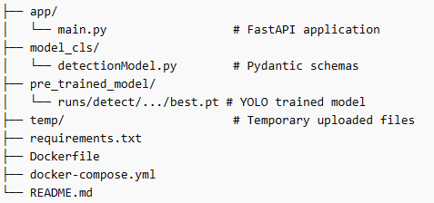
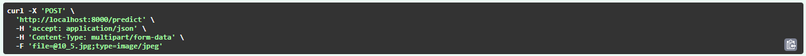
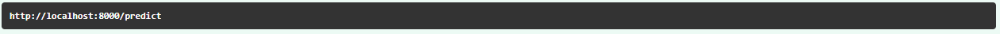
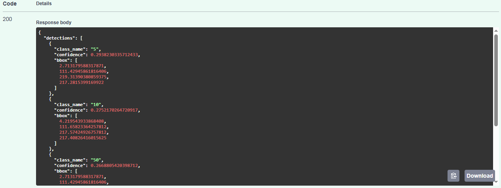
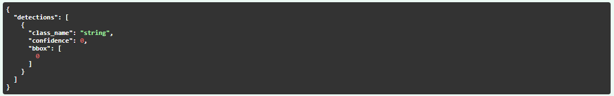

# Assignment_On_Module_17
Assignment: FastAPI and Docker
# Deployment of Bangladeshi Taka Note Detection Model Using REST API & Docker
This project provides a production-ready deployment of a Bangladeshi Taka Note Detection Model using a YOLO (Ultralytics) object detection model, exposed via a FastAPI REST API, and containerized with Docker for easy scalability and deployment.

## Overview

The system allows users to upload an image containing Bangladeshi currency notes and returns:

Detected note types (e.g., 100, 500 Taka)
Confidence scores
Bounding box coordinates

## 📊 Model Info
YOLOv26 trained on Bangladeshi currency dataset

## Technologies Used
FastAPI – High-performance web framework
Ultralytics YOLO – Object detection model
OpenCV – Image processing
Docker & Docker Compose – Containerization
Pydantic – Data validation

## Project Structure

## Run Inference
python -m app.inference

### Inference Output
{
    "class_name":"2",
    "confidence":0.8294647932052612,
    "bbox":[12.779956817626953,0.0,326.4374694824219,197.29469299316406]
}
{
    "class_name":"2",
    "confidence":0.49253571033477783,
    "bbox":[14.669968605041504,0.0,329.3453369140625,197.90655517578125]
}

## 🚀 Setup
### Build and Start Container
docker-compose up --build

### Access API
http://localhost:8000/docs

### Curl

### Request URL

### Server response

### Response headers

## 📡 API Usage

### Endpoint
POST /predict

### Input
- Image file (JPEG/PNG)

### Output
- Detected classes
- Confidence scores
- Bounding boxes